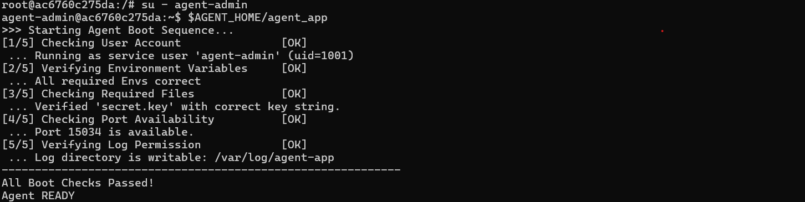
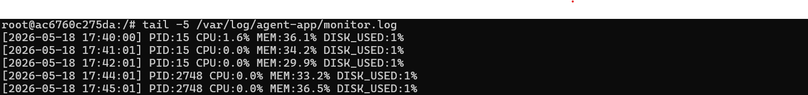
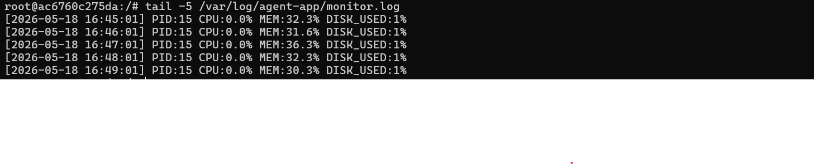

# Codyssey_WorkSpace_B1-1

# Codyssey - 시스템 관제 자동화 스크립트 개발

## 개발 환경

- OS: Ubuntu 24.04 LTS
- 환경: Docker 컨테이너 (`agent-mission`)
- 호스트: Windows 11

---

## 1단계. SSH 보안 설정

### 수행 내역

- SSH 접속 포트를 기본값 22에서 20022로 변경
- Root 계정 원격 로그인 차단

### 명령어

```bash
sed -i 's/#Port 22/Port 20022/' /etc/ssh/sshd_config
sed -i 's/#PermitRootLogin prohibit-password/PermitRootLogin no/' /etc/ssh/sshd_config
service ssh restart
```

### 확인 명령어

```bash
grep -E "^Port|^PermitRootLogin" /etc/ssh/sshd_config
ss -tulnp | grep sshd
```

### 확인 결과

```
Port 20022
PermitRootLogin no
```


### SSH 포트 변경과 Root 접속 차단이 보안에 효과적인 이유 (위협 모델 관점)

**SSH 포트 변경 (22 → 20022)**

기본 포트 22는 전 세계적으로 잘 알려진 SSH 포트입니다. 자동화된 해킹 프로그램(봇)들은 인터넷에 연결된 서버를 탐색하며 22번 포트로 무차별 대입 공격(Brute Force Attack)을 시도합니다. 포트를 20022와 같은 비표준 포트로 변경하면 이러한 자동화된 공격 시도를 대폭 줄일 수 있습니다. 완벽한 보안책은 아니지만 공격 노출 표면(Attack Surface)을 줄이는 효과가 있습니다.

**Root 원격 로그인 차단**

Root 계정은 Linux 시스템의 모든 권한을 가진 최고 관리자 계정입니다. 원격에서 Root 로그인이 허용된 상태에서 공격자가 인증에 성공하면 서버 전체가 즉시 장악됩니다. Root 로그인을 차단하면 공격자는 일반 계정으로만 접속 가능하며 권한이 제한되어 피해를 최소화할 수 있습니다. 올바른 운영 방식은 일반 계정으로 접속 후 필요할 때만 `sudo`로 권한을 상승시키는 것입니다.

---

## 2단계. 방화벽 설정

### 수행 내역

- UFW 방화벽 활성화
- TCP 20022 (SSH), TCP 15034 (APP) 포트만 허용

### 명령어

```bash
ufw --force enable
ufw allow 20022/tcp
ufw allow 15034/tcp
ufw status
```

### 확인 결과

```
Status: active

To                         Action      From
--                         ------      ----
20022/tcp                  ALLOW       Anywhere
15034/tcp                  ALLOW       Anywhere
```

%20활성화.png)

---

## 3단계. 계정/그룹 생성

### 수행 내역

- 계정 3개 생성: `agent-admin`, `agent-dev`, `agent-test`
- 그룹 2개 생성: `agent-common`, `agent-core`
- 그룹 멤버 구성
  - `agent-common`: admin, dev, test
  - `agent-core`: admin, dev

### 명령어

```bash
useradd -m -s /bin/bash agent-admin
useradd -m -s /bin/bash agent-dev
useradd -m -s /bin/bash agent-test

groupadd agent-common
groupadd agent-core

usermod -aG agent-common agent-admin
usermod -aG agent-common agent-dev
usermod -aG agent-common agent-test

usermod -aG agent-core agent-admin
usermod -aG agent-core agent-dev
```

### 확인 명령어

```bash
id agent-admin
id agent-dev
id agent-test
```

### 확인 결과

```
uid=1000(agent-admin) gid=1002(agent-admin) groups=1002(agent-admin),1000(agent-common),1001(agent-core)
uid=1001(agent-dev)   gid=1003(agent-dev)   groups=1003(agent-dev),1000(agent-common),1001(agent-core)
uid=1002(agent-test)  gid=1004(agent-test)  groups=1004(agent-test),1000(agent-common)
```


---

## 4단계. 디렉토리 구조 + 권한 + ACL

### 수행 내역

- 디렉토리 구조 생성
- 소유 그룹 및 권한 설정
- ACL 설정

### 디렉토리 구조

```
/home/agent-admin/agent-app/
├── agent_app         # 실행 파일
├── upload_files/     # group: agent-common, 권한: 770
├── api_keys/         # group: agent-core,   권한: 770
└── bin/              # monitor.sh 위치
/var/log/agent-app/   # group: agent-core,   권한: 770
```

### 명령어

```bash
mkdir -p /home/agent-admin/agent-app/upload_files
mkdir -p /home/agent-admin/agent-app/api_keys
mkdir -p /home/agent-admin/agent-app/bin
mkdir -p /var/log/agent-app

chown agent-admin:agent-common /home/agent-admin/agent-app/upload_files
chmod 770 /home/agent-admin/agent-app/upload_files

chown agent-admin:agent-core /home/agent-admin/agent-app/api_keys
chmod 770 /home/agent-admin/agent-app/api_keys

chown agent-admin:agent-core /var/log/agent-app
chmod 770 /var/log/agent-app

setfacl -m g:agent-common:rwx /home/agent-admin/agent-app/upload_files
setfacl -m g:agent-core:rwx /home/agent-admin/agent-app/api_keys
setfacl -m g:agent-core:rwx /var/log/agent-app
```

### 확인 명령어

```bash
ls -l /home/agent-admin/agent-app/
getfacl /home/agent-admin/agent-app/upload_files
getfacl /home/agent-admin/agent-app/api_keys
```

%20확인%20내역.png)

### api_keys와 로그 디렉토리를 agent-core로 제한한 이유 (최소 권한 원칙)

최소 권한 원칙(Principle of Least Privilege)이란 각 계정이 업무 수행에 필요한 최소한의 권한만 갖도록 설계하는 보안 원칙입니다.

`api_keys` 디렉토리에는 서비스 인증에 사용되는 비밀 키 파일이 저장됩니다. 이 파일이 노출되면 서비스 전체의 보안이 위협받습니다. QA/테스트 목적의 `agent-test` 계정은 키 파일에 접근할 업무적 필요가 없으므로 `agent-core` 그룹(admin, dev만 포함)으로 접근을 제한하였습니다.

`/var/log/agent-app` 디렉토리도 마찬가지로 시스템 운영 로그가 저장되는 민감한 경로입니다. 테스트 계정이 로그를 임의로 수정하거나 삭제할 경우 장애 원인 분석이 불가능해지므로 `agent-core`로 접근을 제한하였습니다.

---

## 5단계. 환경변수 설정

### 수행 내역

- `agent-admin` 계정의 `.bashrc`에 환경변수 추가
- `agent_app` 실행 시 필요한 경로/포트 정보를 환경변수로 관리

### 명령어

```bash
cat >> /home/agent-admin/.bashrc << 'EOF'

# Agent App Environment Variables
export AGENT_HOME=/home/agent-admin/agent-app
export AGENT_PORT=15034
export AGENT_UPLOAD_DIR=$AGENT_HOME/upload_files
export AGENT_KEY_PATH=$AGENT_HOME/api_keys/t_secret.key
export AGENT_LOG_DIR=/var/log/agent-app
EOF

source /home/agent-admin/.bashrc
```

### 확인 결과

```
/home/agent-admin/agent-app
15034
/var/log/agent-app
```

---

## 6단계. 키 파일 생성

### 수행 내역

- `agent_app` 인증에 필요한 키 파일 생성

### 명령어

```bash
echo "agent_api_key_test" > /home/agent-admin/agent-app/api_keys/t_secret.key
```

### 확인 결과

```
agent_api_key_test
```

---

## 7단계. 앱 실행

### 수행 내역

- `agent-admin` 계정으로 `agent_app` 실행
- Boot Sequence 5단계 [OK] 및 Agent READY 확인
- 0.0.0.0:15034 LISTEN 상태 확인

### 명령어

```bash
su - agent-admin
$AGENT_HOME/agent_app
```

### Boot Sequence 확인 결과

```
>>> Starting Agent Boot Sequence...
[1/5] Checking User Account               [OK]
[2/5] Verifying Environment Variables     [OK]
[3/5] Checking Required Files             [OK]
[4/5] Checking Port Availability          [OK]
[5/5] Verifying Log Permission            [OK]
------------------------------------------------------------
All Boot Checks Passed!
Agent READY
```



### 포트 확인 결과

```
tcp   LISTEN 0  1  0.0.0.0:15034  0.0.0.0:*  users:(("agent_app",pid=4772,fd=4))
```

---

## 8단계. monitor.sh 작성

### 수행 내역

- 시스템 상태 수집 및 로깅 스크립트 작성
- 파일 위치: `/home/agent-admin/agent-app/bin/monitor.sh`
- 소유자: `agent-dev`, 그룹: `agent-core`, 권한: `750`

### 권한 설정 명령어

```bash
chown agent-dev:agent-core /home/agent-admin/agent-app/bin/monitor.sh
chmod 750 /home/agent-admin/agent-app/bin/monitor.sh
```

### 확인 결과

```
-rwxr-x--- 1 agent-dev agent-core 1856 May 18 15:58 /home/agent-admin/agent-app/bin/monitor.sh
```


### monitor.sh 권한 정책 설명 (소유자: agent-dev, 실행자: agent-admin)

monitor.sh의 권한은 `750`으로 설정되어 있습니다.

```
7 (rwx) → 소유자(agent-dev): 읽기/쓰기/실행 가능
5 (r-x) → 소유그룹(agent-core): 읽기/실행만 가능
0 (---) → 나머지: 접근 불가
```

- **소유자를 agent-dev로 설정한 이유**: monitor.sh는 개발/운영 담당자인 agent-dev가 작성하고 유지보수하는 스크립트이므로 agent-dev가 소유자입니다.
- **그룹을 agent-core로 설정한 이유**: cron으로 매분 실행하는 주체는 agent-admin입니다. agent-admin은 agent-core 그룹에 속해 있으므로 그룹 권한(r-x)으로 실행이 가능합니다.
- **나머지를 0으로 설정한 이유**: agent-test 등 불필요한 계정이 모니터링 스크립트를 실행하거나 내용을 볼 수 없도록 차단합니다.

이 구조를 통해 작성자(agent-dev)와 실행자(agent-admin)의 역할을 분리하면서 최소 권한 원칙을 만족시켰습니다.

### pgrep과 ss 명령어를 선택한 이유

**pgrep 선택 이유**

프로세스 실행 상태 확인에 `pgrep -f agent_app` 명령어를 사용하였습니다.

- `pgrep`은 프로세스 이름으로 PID를 직접 반환하므로 별도의 파싱 없이 PID를 바로 활용할 수 있습니다.
- `-f` 옵션을 사용하면 실행 파일명 전체를 기준으로 검색하므로 정확한 프로세스 식별이 가능합니다.
- `ps aux | grep agent_app` 방식은 grep 프로세스 자체가 결과에 포함될 수 있어 오탐이 발생할 수 있지만 `pgrep`은 이 문제가 없습니다.

**ss 선택 이유**

포트 리슨 상태 확인에 `ss -tulnp` 명령어를 사용하였습니다.

- `ss`는 `netstat`의 대체 명령어로 더 빠르고 최신 Linux 환경에서 권장됩니다.
- `-t` (TCP), `-u` (UDP), `-l` (리슨 상태), `-n` (숫자로 표시), `-p` (프로세스 정보) 옵션 조합으로 원하는 정보를 정확하게 필터링할 수 있습니다.

### CPU/MEM/DISK 값 추출 방식 및 로그 포맷 고정 이유

**CPU 추출 방식**

```bash
CPU=$(top -bn1 | grep "Cpu(s)" | awk '{print $2}' | cut -d'%' -f1)
```

`top -bn1`으로 1회 실행 후 종료하고, `Cpu(s)` 라인에서 사용자 CPU 사용률을 `awk`로 추출합니다. `cut -d'%' -f1`로 `%` 기호를 제거하여 숫자만 남깁니다.

**MEM 추출 방식**

```bash
MEM=$(free | grep Mem | awk '{printf("%.1f", $3/$2*100)}')
```

`free` 명령어에서 전체 메모리($2)와 사용 중인 메모리($3)를 구해 백분율로 계산합니다. `printf("%.1f")`로 소수점 1자리까지 표시합니다.

**DISK 추출 방식**

```bash
DISK=$(df / | tail -1 | awk '{print $5}' | tr -d '%')
```

`df /`로 루트 파티션 사용률을 확인하고, 마지막 줄에서 5번째 컬럼(사용률)을 추출한 후 `%` 기호를 제거합니다.

**로그 포맷을 고정한 이유**

```
[YYYY-MM-DD HH:MM:SS] PID:... CPU:..% MEM:..% DISK_USED:..%
```

로그 포맷을 고정한 이유는 다음과 같습니다.
- 시간 기반 정렬 및 특정 시간대 로그 검색이 용이합니다.
- `awk`, `grep` 등으로 자동화된 로그 분석 스크립트 작성이 가능합니다.
- 여러 지표가 한 줄에 기록되어 특정 시점의 시스템 상태를 한눈에 파악할 수 있습니다.
- report.sh 같은 분석 스크립트에서 일관된 방식으로 파싱할 수 있습니다.

### 경고는 출력하되 종료하지 않는 항목을 분리한 운영상의 이유

monitor.sh에서 상태 점검 항목은 두 가지로 분류됩니다.

**즉시 종료(exit 1) 항목**
- 프로세스 미실행: 앱 자체가 죽은 것이므로 더 이상 모니터링을 진행할 의미가 없습니다.
- 포트 미리슨: 앱이 실행 중이지 않거나 정상 동작하지 않는 상태이므로 즉시 종료합니다.

**경고만 출력(WARNING) 항목**
- 방화벽 비활성화: 방화벽이 꺼져 있어도 앱 자체는 정상 동작합니다. 경고를 남기고 모니터링을 계속합니다.
- CPU/MEM/DISK 임계값 초과: 리소스가 높아도 서비스가 즉시 중단되는 것은 아닙니다. 경고를 기록하고 운영자가 판단하도록 합니다.

이렇게 분리한 이유는 **서비스 가용성(Availability)을 최대한 유지**하기 위해서입니다. 사소한 경고에도 스크립트가 종료되면 로그 수집이 중단되어 오히려 문제 추적이 어려워집니다.

### 리다이렉션 기호 > 와 >> 차이 및 >>가 필요한 이유

| 기호 | 동작 |
|---|---|
| `>` | 파일 내용을 덮어씀 (기존 내용 삭제) |
| `>>` | 파일 끝에 추가 (기존 내용 유지) |

**예시**

```bash
echo "첫 번째" > monitor.log   # 파일에 "첫 번째" 기록
echo "두 번째" > monitor.log   # 파일 내용이 "두 번째"로 덮어씌워짐 → 첫 번째 삭제됨

echo "첫 번째" >> monitor.log  # 파일에 "첫 번째" 기록
echo "두 번째" >> monitor.log  # 파일에 "두 번째" 추가 → 두 줄 모두 유지됨
```

로그는 시간의 흐름에 따른 시스템 상태를 누적 기록해야 장애 발생 시 원인 추적이 가능합니다. `>`를 사용하면 매 실행마다 이전 로그가 삭제되므로 반드시 `>>`를 사용해야 합니다.

---

## 9단계. crontab 등록

### 수행 내역

- `agent-admin` 계정의 crontab에 `monitor.sh` 매분 실행 등록

### 명령어

```bash
apt-get install -y cron
service cron start

su - agent-admin
crontab -e
```

### 등록 내용

```
* * * * * /bin/bash /home/agent-admin/agent-app/bin/monitor.sh >> /var/log/agent-app/cron.log 2>&1
```

### monitor.log 누적 확인 결과

```
[2026-05-18 16:45:01] PID:15 CPU:0.0% MEM:32.3% DISK_USED:1%
[2026-05-18 16:46:01] PID:15 CPU:0.0% MEM:31.6% DISK_USED:1%
[2026-05-18 16:47:01] PID:15 CPU:0.0% MEM:36.3% DISK_USED:1%
[2026-05-18 16:48:01] PID:15 CPU:0.0% MEM:32.3% DISK_USED:1%
[2026-05-18 16:49:01] PID:15 CPU:0.0% MEM:30.3% DISK_USED:1%
```




---

## 운영 관련 설명

### monitor.log 용량 관리(10MB/10개) 구현 방식 및 동작 설명

로그 파일은 매분 누적되므로 장기간 운영 시 디스크를 가득 채울 수 있습니다. 이를 방지하기 위해 스크립트 내에서 직접 용량 관리 로직을 구현하였습니다.

**구현 방식**

```bash
LOG_SIZE=$(du -b "$LOG_FILE" 2>/dev/null | cut -f1)
MAX_SIZE=$((10 * 1024 * 1024))  # 10MB

if [ -n "$LOG_SIZE" ] && [ "$LOG_SIZE" -gt "$MAX_SIZE" ]; then
    ls -t ${LOG_FILE}.* 2>/dev/null | tail -n +10 | xargs rm -f
    mv "$LOG_FILE" "${LOG_FILE}.$(date '+%Y%m%d%H%M%S')"
fi
```

**동작 흐름**

1. `du -b`로 현재 monitor.log 파일 크기를 바이트 단위로 측정합니다.
2. 파일 크기가 10MB(10,485,760 bytes)를 초과하면 로테이션을 시작합니다.
3. 기존 백업 파일 목록을 최신순으로 정렬하여 10번째 이후 파일을 삭제합니다 (`tail -n +10 | xargs rm -f`).
4. 현재 monitor.log를 타임스탬프가 붙은 백업 파일로 이름을 변경합니다 (예: `monitor.log.20260518164501`).
5. 다음 실행부터 새로운 monitor.log가 생성됩니다.

이 방식으로 최대 10MB 파일 10개, 즉 최대 100MB까지만 로그를 유지합니다.

### 모니터링 대상이 웹 서버(Nginx 등)로 바뀔 때 변경해야 할 핵심 포인트

현재 monitor.sh는 `agent_app` 프로세스와 포트 15034를 기준으로 작성되어 있습니다. 모니터링 대상이 Nginx 웹 서버로 바뀌는 경우 다음 항목을 변경해야 합니다.

| 항목 | 현재 (agent_app) | 변경 후 (Nginx) |
|---|---|---|
| 프로세스명 | `agent_app` | `nginx` |
| 모니터링 포트 | `15034` | `80` 또는 `443` |
| 로그 경로 | `/var/log/agent-app/monitor.log` | `/var/log/nginx/monitor.log` |
| CPU 임계값 | 20% | 서비스 특성에 맞게 재설정 |
| MEM 임계값 | 10% | 서비스 특성에 맞게 재설정 |

핵심은 `APP_NAME`, `APP_PORT`, `LOG_FILE` 변수만 변경하면 나머지 로직은 그대로 재사용 가능하도록 스크립트를 변수 기반으로 설계한 것입니다.

### 프로세스는 살아있는데 포트가 안 열리는 상황의 원인 후보와 확인 순서

`pgrep`으로 프로세스가 존재하는데 `ss`로 포트가 리슨되지 않는 상황은 다음과 같은 원인이 있을 수 있습니다.

**원인 후보**

1. 앱이 초기화 중인 경우: 프로세스는 시작됐지만 포트 바인딩 전 단계
2. 포트 바인딩 실패: 이미 다른 프로세스가 해당 포트를 점유 중
3. 앱 내부 오류: 포트 바인딩 로직에서 예외가 발생하여 리슨 없이 대기 중
4. 환경변수 오류: `AGENT_PORT` 등 환경변수가 잘못 설정되어 다른 포트로 바인딩 시도

**확인 순서**

```bash
# 1. 프로세스 상태 확인
pgrep -f agent_app

# 2. 전체 포트 리슨 상태 확인 (15034 외 다른 포트로 열렸을 수 있음)
ss -tulnp | grep agent_app

# 3. 해당 포트를 점유 중인 프로세스 확인
ss -tulnp | grep :15034

# 4. 앱 로그 확인
tail -50 /var/log/agent-app/monitor.log

# 5. 환경변수 확인
echo $AGENT_PORT
```

### 로그가 급증해 디스크가 가득 찰 위험이 있을 때 운영자가 취할 대응

**단기 대응 (즉시 조치)**

```bash
# 현재 디스크 사용량 확인
df -h /

# 로그 파일 크기 확인
du -sh /var/log/agent-app/*

# 오래된 로그 즉시 삭제
find /var/log/agent-app/ -name "*.log.*" -mtime +7 -delete

# 현재 로그 압축
gzip /var/log/agent-app/monitor.log.2026*
```

**중기 대응 (재발 방지)**

1. logrotate 설정 추가: 시스템 수준에서 로그 로테이션을 관리합니다.
2. 로그 임계값 조정: monitor.sh에서 DISK 경고 임계값을 낮춰(예: 80% → 60%) 더 일찍 경고를 받도록 합니다.
3. 로그 보존 기간 단축: 백업 파일 유지 개수를 10개에서 5개로 줄입니다.
4. 외부 로그 수집 도구 도입: ELK Stack, Loki 등 전문 로그 관리 시스템으로 이관을 검토합니다.

---

## monitor.sh 소스코드

```bash
#!/bin/bash

LOG_FILE=/var/log/agent-app/monitor.log
TIMESTAMP=$(date '+%Y-%m-%d %H:%M:%S')
APP_NAME="agent_app"
APP_PORT=15034

echo "====== SYSTEM MONITOR RESULT ======"

echo ""
echo "[HEALTH CHECK]"

PID=$(pgrep -f "$APP_NAME" | head -1)
if [ -z "$PID" ]; then
    echo "Checking process '$APP_NAME'... [FAIL]"
    exit 1
else
    echo "Checking process '$APP_NAME'... [OK] (PID: $PID)"
fi

PORT_STATUS=$(ss -tulnp | grep ":$APP_PORT ")
if [ -z "$PORT_STATUS" ]; then
    echo "Checking port $APP_PORT... [FAIL]"
    exit 1
else
    echo "Checking port $APP_PORT... [OK]"
fi

echo ""
echo "[FIREWALL CHECK]"
UFW_STATUS=$(ufw status | grep -i "Status:" | awk '{print $2}')
if [ "$UFW_STATUS" != "active" ]; then
    echo "[WARNING] Firewall is not active"
else
    echo "Firewall status... [OK]"
fi

echo ""
echo "[RESOURCE MONITORING]"

CPU=$(top -bn1 | grep "Cpu(s)" | awk '{print $2}' | cut -d'%' -f1)
MEM=$(free | grep Mem | awk '{printf("%.1f", $3/$2*100)}')
DISK=$(df / | tail -1 | awk '{print $5}' | tr -d '%')

echo "CPU Usage  : ${CPU}%"
echo "MEM Usage  : ${MEM}%"
echo "DISK Used  : ${DISK}%"

if (( $(echo "$CPU > 20" | bc -l) )); then
    echo "[WARNING] CPU threshold exceeded (${CPU}% > 20%)"
fi

if (( $(echo "$MEM > 10" | bc -l) )); then
    echo "[WARNING] MEM threshold exceeded (${MEM}% > 10%)"
fi

if [ "$DISK" -gt 80 ]; then
    echo "[WARNING] DISK threshold exceeded (${DISK}% > 80%)"
fi

echo ""
echo "[INFO] Log appended: $LOG_FILE"
echo "[$TIMESTAMP] PID:$PID CPU:${CPU}% MEM:${MEM}% DISK_USED:${DISK}%" >> $LOG_FILE

LOG_SIZE=$(du -b "$LOG_FILE" 2>/dev/null | cut -f1)
MAX_SIZE=$((10 * 1024 * 1024))

if [ -n "$LOG_SIZE" ] && [ "$LOG_SIZE" -gt "$MAX_SIZE" ]; then
    ls -t ${LOG_FILE}.* 2>/dev/null | tail -n +10 | xargs rm -f
    mv "$LOG_FILE" "${LOG_FILE}.$(date '+%Y%m%d%H%M%S')"
fi

echo "======================================"
```
